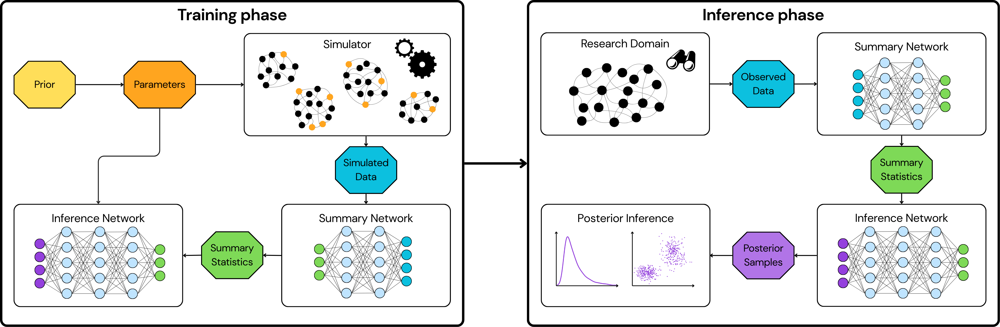

# From Mice to Trains: Amortized Bayesian Inference on Graph Data

__Authors:__  Svenja Jedhoff, Elizaveta Semenova, Aura Raulo, Anne Meyer, Paul-Christian Bürkner

------------------------------------------------------------------------

## Overview

This repository contains code to replicate key experiments from our
[paper]() ' From Mice to Trains: Amortized Bayesian Inference on Graph Data'.



------------------------------------------------------------------------


## Reproducing the Experiments

The experiments are organized into three case studies:

- `case_study_toy/` — toy example
- `case_study_mice/` — mice case study
- `case_study_trains/` — trains case study

Each folder contains the code required to run the corresponding experiment end-to-end.

## Reproducing the experiments

### 1) Simulate training data (R)

For the **mice** and **trains** case studies, training data are simulated in R:

- `mice_simulate_training_data.R`
- `trains_simulate_training_data.R`

(Located in the respective case study folders.)

### 2) Run simulations and train / evaluate (Python + BayesFlow)

Simulation and inference are run in Python using the [**BayesFlow**](https://bayesflow.org/main/index.html) package:

- `toy_run_simulation.py`
- `mice_run_simulation.py`
- `trains_run_simulation.py`


## Notes

- The pipeline is: **simulate data in R → run simulation / inference in Python (BayesFlow)**.
- If you are looking for additional files (e.g., pretrained networks or intermediate outputs), please contact:  
  **jedhoff@statistik.tu-dortmund.de**


## Citation

```bibtex
@misc{jedhoff2026micetrainsamortizedbayesian,
      title={From Mice to Trains: Amortized Bayesian Inference on Graph Data}, 
      author={Svenja Jedhoff and Elizaveta Semenova and Aura Raulo and Anne Meyer and Paul-Christian Bürkner},
      year={2026},
      eprint={2601.02241},
      archivePrefix={arXiv},
      primaryClass={stat.ML},
      url={https://arxiv.org/abs/2601.02241}, 
}
```