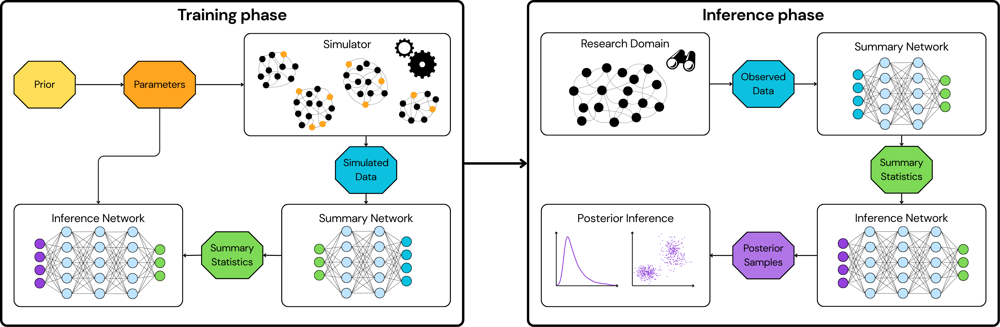

# From Mice to Trains: Amortized Bayesian Inference on Graph Data

**Authors:** Svenja Jedhoff, Elizaveta Semenova, Aura Raulo, Anne Meyer, Paul-Christian Bürkner

---

## Overview

This repository contains code to reproduce the key experiments from our paper [*From Mice to Trains: Amortized Bayesian Inference on Graph Data*](https://arxiv.org/abs/2601.02241).



---

## Repository Structure

The experiments are organized into three case studies:

| Folder | Description |
|---|---|
| `case_study_toy/` | Toy example |
| `case_study_mice/` | Mice interaction network case study |
| `case_study_trains/` | Trains scheduling case study |

Each folder contains all code required to run the corresponding experiment end-to-end.

---

## Reproducing the Experiments

### Step 1 — Simulate training data (R)

For the **mice** and **trains** case studies, training data are simulated in R using the scripts located in the respective case study folders:

- `mice_simulate_training_data.R`
- `trains_simulate_training_data.R`

The **toy** case study uses an online simulator implemented in Python, so no separate data simulation step is required.

### Step 2 — Train and evaluate models (Python + BayesFlow)

Inference is performed in Python using the [BayesFlow](https://bayesflow.org/main/index.html) package:

- `toy_run_simulation.py`
- `mice_run_simulation.py`
- `trains_run_simulation.py`

---

## Mice Case Study: Real-World Data Analysis

Files for the real-world data analysis are located in `case_study_mice/` and share 
the prefix `mice_real_data_`. The code expects the following data 
files from [Raulo et al. (2023)](https://catalogue.ceh.ac.uk/documents/043513e5-406c-4477-89aa-c96059acb232) to be placed in `case_study_mice/real_data/`:

- `Wytham_HH_Logger_tag_data.csv`
- `Wytham_HH_processed_microbiome_data.rds`
- Supplementary Table 4 from [Raulo et al. (2024)](https://www.nature.com/articles/s41559-024-02381-0#Sec19)

---

## Appendix: Comparison to MCMC Baseline

The Python and Stan code for the simplified toy example — in which an analytical likelihood is tractable and comparison against MCMC is feasible — can be found in `case_study_toy/analytical_likelihood_case/`.

---

## Notes

- The general pipeline is: **simulate data in R or Python → run simulation and inference in Python (BayesFlow)**.
- For additional files such as pretrained networks or intermediate outputs, please contact: **jedhoff@statistik.tu-dortmund.de**

---

## Requirements

Python package dependencies and their versions are listed in `requirements.txt`. To install them, run:
```bash
pip install -r requirements.txt
```
---

## Citation

```bibtex
@misc{jedhoff2026micetrainsamortizedbayesian,
      title={From Mice to Trains: Amortized Bayesian Inference on Graph Data}, 
      author={Svenja Jedhoff and Elizaveta Semenova and Aura Raulo and Anne Meyer and Paul-Christian Bürkner},
      year={2026},
      eprint={2601.02241},
      archivePrefix={arXiv},
      primaryClass={stat.ML},
      url={https://arxiv.org/abs/2601.02241}, 
}
```